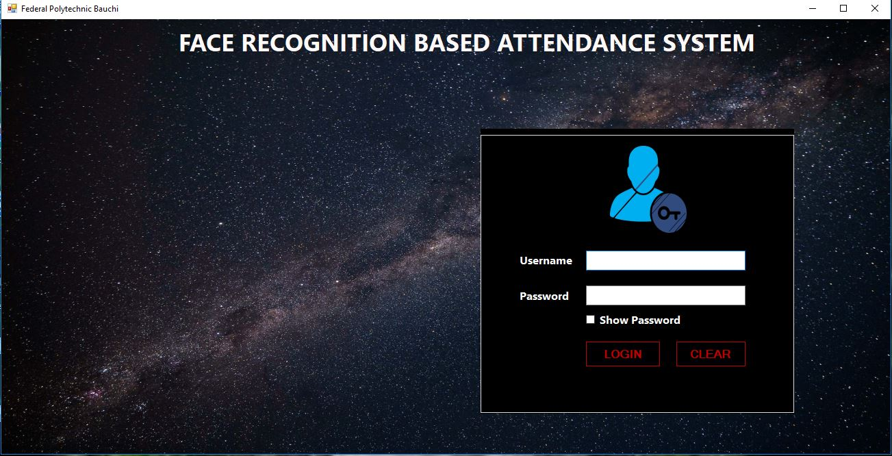
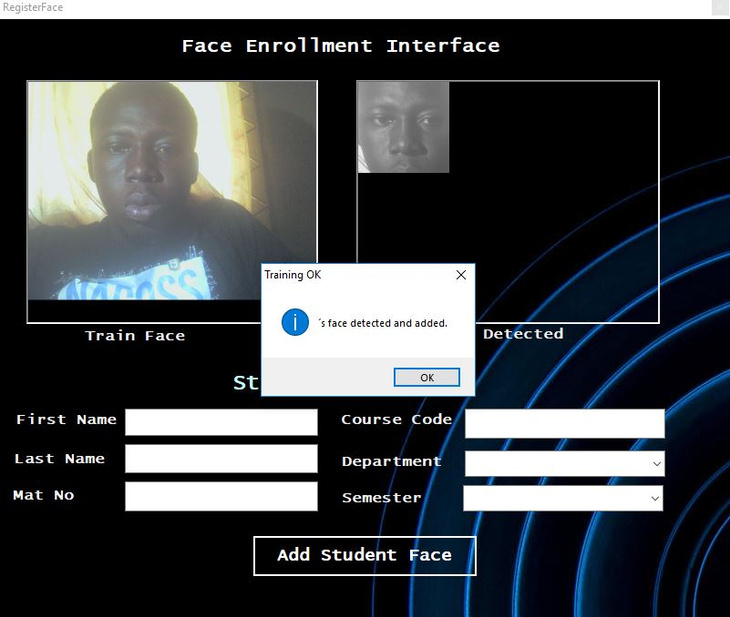
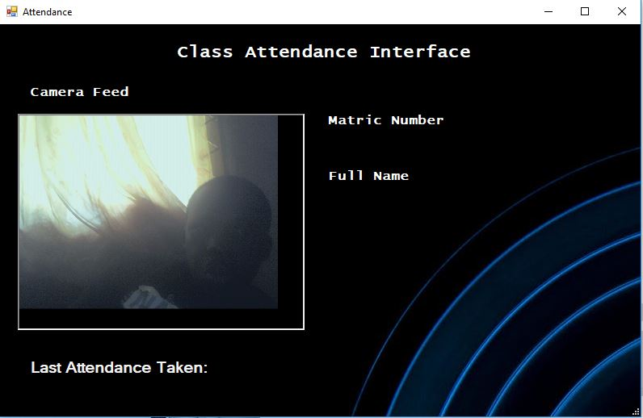

# Face Recognition Attendance System 

The software is a Face Recognition Attendance System  is an innovative, turn-key, end-to-end securities-based attendance platform that 
allows school to keep track of student attendance
 This software was developed using Micrioft C# and SQLite.
 
 link to executable files :
 Link 1 : https://github.com/Ejigsonpeter/attendance/blob/master/bin/Debug/MultiFaceRec.exe
 Link 2 : https://github.com/Ejigsonpeter/eimcsupdate/blob/personal/Eimcs/Debug/Eimcs.msi

Below is the login Screen

Student Enrollment

Attendance

Developed by Ejigapeter :
contact me @ +2348136777456 or ejigsonpeter@gmail.com
